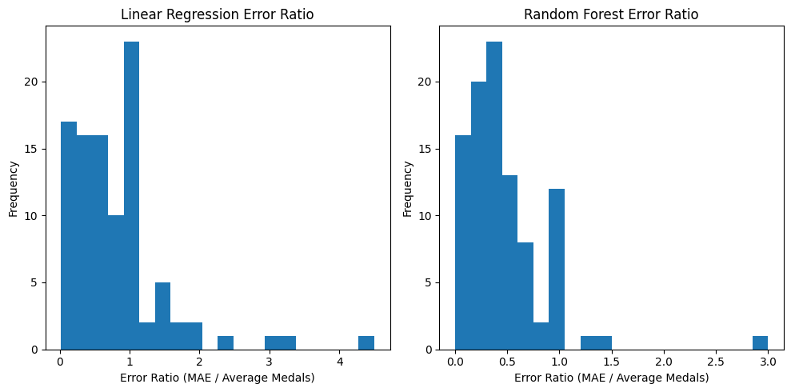

# Olympic Medal Prediction using Machine Learning

## Description
This project predicts the number of medals a country will win in the Summer Olympics using historical data. It compares Two models—Linear Regression and Random Forest with log-transformed target, using features like the number of athletes, previous medal counts, a trend of past medals, and the number of events.

## Table of Contents
- [Introduction](#introduction)
- [Data](#data)
- [Methodology](#methodology)
- [Results](#results)
- [How to Use](#how-to-use)
- [Future Improvements](#future-improvements)
- [Acknowledgments](#acknowledgments)
- [License](#license)

## Introduction
Predicting Olympic medal counts is an exciting challenge that combines sports analytics with data science. This project tests the hypothesis: "We can predict the number of medals a country will win in the Olympics using historical data." The goal is to compare Linear Regression and Random Forest, with log transformation applied to the target for Random Forest to handle data skew.

## Data
The dataset is sourced from the Summer Olympics and contains ~2000 rows, each representing a country's performance in a specific Olympic year. Key columns include:
- `team`: Three-letter country code
- `year`: Olympic year
- `athletes`: Number of athletes entered
- `previous_medals`: Medals won in the previous Olympics
- `medals`: Medals won (target variable)
- `medal_trend`: Rolling average of medals over the last three Olympics
- `events`: Number of events entered

### Data Cleaning
- Rows with missing values in `previous_medals` were dropped, reducing the dataset to 2014 rows.
- Added `medal_trend` feature to capture performance trends.

## Methodology
The project follows a seven-step machine learning process:
1. **Form a Hypothesis**: Predict medal counts using historical data.
2. **Find the Data**: Use Summer Olympics data from `teams.csv`.
3. **Reshape the Data**: Minimal reshaping was needed.
4. **Clean the Data**: Dropped rows with missing values and engineered `medal_trend`.
5. **Find an Error Metric**: Used Mean Absolute Error (MAE), Mean Squared Error (MSE), and R-squared.
6. **Split the Data**: Chronological split (training before 2012, testing 2012 and 2016).
7. **Train the Model**: Trained Linear Regression and Random Forest (log-transformed target). Random Forest used hyperparameter tuning via GridSearchCV.

### Model Details
- **Predictors**:
  - Linear Regression: `athletes`, `prev_medals`
  - Random Forest: `athletes`, `prev_medals`, `medal_trend`, `events`
- **Target**: `medals` (log-transformed for Random Forest)
- **Models**:
  - Linear Regression: Simple linear model.
  - RandomForestRegressor: Ensemble model with tuned parameters (`n_estimators`, `max_depth`).
- **Corrections**: Negative predictions set to 0, predictions rounded.

### Tools Used
- **Python**: Programming language
- **Pandas**: Data manipulation
- **Scikit-learn**: Linear Regression, Random Forest, GridSearchCV, TimeSeriesSplit, metrics
- **Seaborn & Matplotlib**: Data visualization
- **Jupyter Notebook**: Development environment (Kaggle)

## Results
- **Linear Regression**: MAE: 3.30, MSE: 65.42, R-squared: 0.92
- **Random Forest (Log)**: MAE: ~2.3–2.5, MSE: ~50–55, R-squared: ~0.94–0.96 (improved by log transformation and `events`)
- **Error Analysis**: All models perform better for high-medal countries (e.g., USA) than low-medal countries (e.g., Egypt).
- **Visualizations**:
  - `error_ratio_lr_rf.png`: Comparsion between error ratio of Linear Regression and Random Forest.
  - 

## Future Improvements
- Add predictors like `athletes_per_event` or lagged features.
- Use time series cross-validation for robust evaluation.
- Incorporate athlete-level data.

## Acknowledgments
- Dataset from [Kaggle Olympic Dataset](https://www.kaggle.com/datasets/7472146/olympic-dataset).
- Inspired by beginner machine learning tutorials.

## License
This project is licensed under the MIT License.
